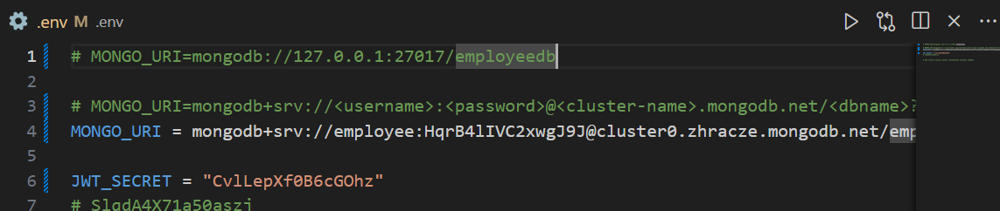
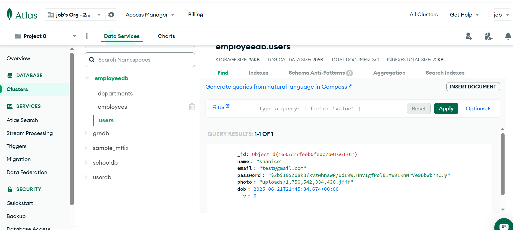
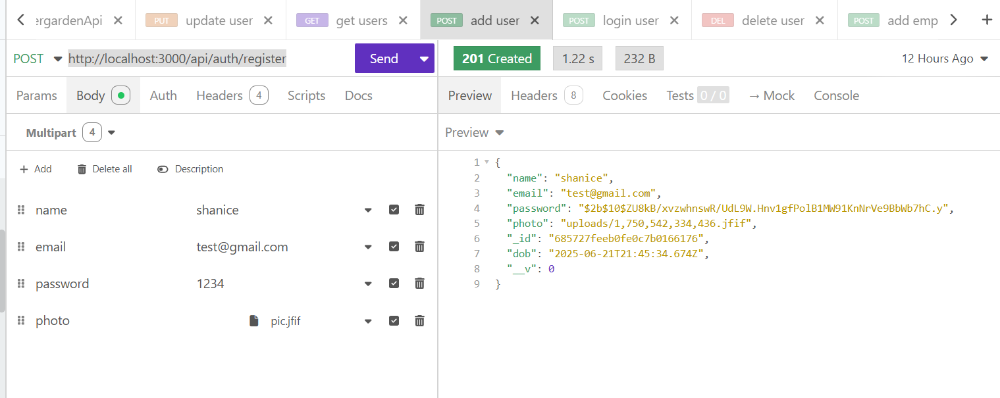
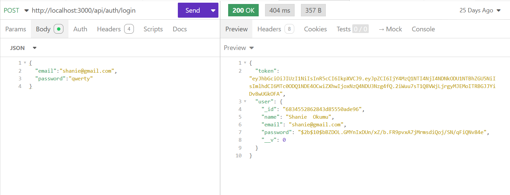
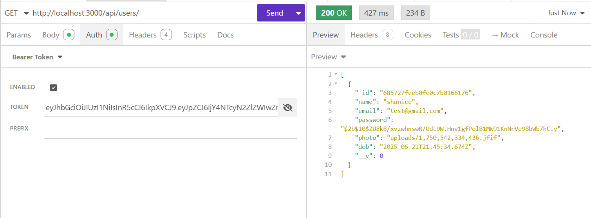
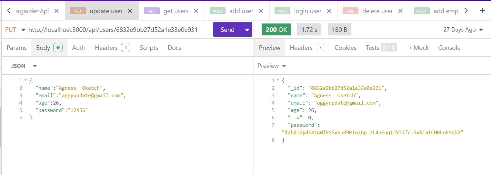
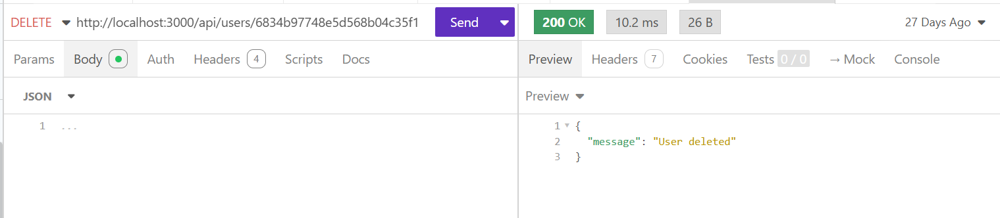
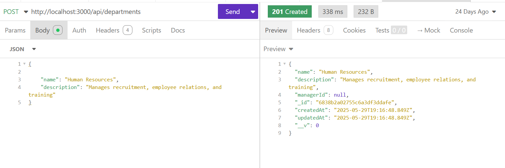
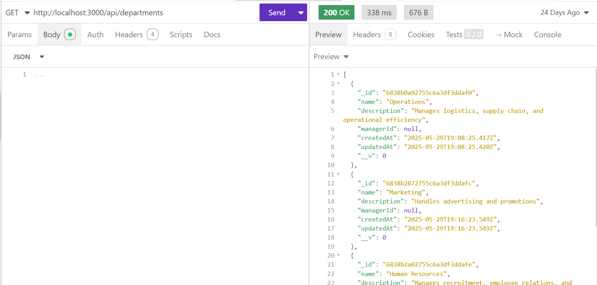
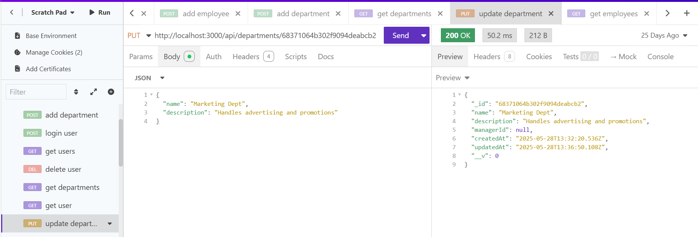

# 🧑‍💼 Employee Management System API – Step-by-Step Guide

This guide walks you through building a complete **Express.js REST API** for managing **Users**, **Employees**, and **Departments**, with features like:

* ✅ User registration with photo upload
* 🔒 Secure login using JWT
* 👤 CRUD operations for users
* 🏢 Department management
* 👥 Employee assignment and management
* 🛡️ Protected routes using middleware

---

## 🛠️ Prerequisites

Before we start, make sure you have:

* Node.js & npm installed
* MongoDB running locally or a connection string from MongoDB Atlas
* Insomnia or any API testing tool
* Basic understanding of JavaScript & Express.js

---

## 📁 Step 1: Project Setup

```bash
mkdir employee-api
cd employee-api
npm init -y
npm install express mongoose dotenv bcryptjs jsonwebtoken multer cors
```

Create the file structure:

```bash
mkdir models routes middleware uploads
touch app.js .env
```

---

## 🔗 Step 2: Environment Variables

Create a `.env` file:

```env
PORT=3000
MONGO_URI=your_mongodb_connection_string
JWT_SECRET=your_super_secret_key
```

---


## 📦 Step 3: Define Mongoose Schemas

Create `models/model.js`:

```js
// models/model.js
const mongoose = require('mongoose');
const Schema = mongoose.Schema;

const userSchema = new Schema({
  name: String,
  email: { type: String, required: true, unique: true },
  dob: { type: Date, default: Date.now },
  password: { type: String, required: true },
  photo: String,
});

const employeeSchema = new Schema({
  userId: { type: Schema.Types.ObjectId, ref: 'User', default: null },
  firstName: String,
  lastName: String,
  email: { type: String, required: true, unique: true },
  departmentId: { type: Schema.Types.ObjectId, ref: 'Department', required: true },
  jobTitle: String,
  hireDate: Date,
  salary: Number,
  status: { type: String, enum: ['active', 'inactive', 'on_leave'], default: 'active' },
  createdAt: { type: Date, default: Date.now },
  updatedAt: { type: Date, default: Date.now },
});

const departmentSchema = new Schema({
  name: { type: String, required: true, unique: true },
  description: String,
  managerId: { type: Schema.Types.ObjectId, ref: 'Employee', default: null },
  createdAt: { type: Date, default: Date.now },
  updatedAt: { type: Date, default: Date.now },
});

const User = mongoose.model('User', userSchema);
const Employee = mongoose.model('Employee', employeeSchema);
const Department = mongoose.model('Department', departmentSchema);

module.exports = { User, Employee, Department };
```

---

## 🛠️ Step 4: Set Up Express Server

In `app.js`:

```js
const express = require('express');
const mongoose = require('mongoose');
const cors = require('cors');
require('dotenv').config();

const app = express();
app.use(express.json());
app.use(cors());
app.use('/uploads', express.static('uploads')); // for serving photos

// Routes
app.use('/api/auth', require('./routes/auth'));
app.use('/api/users', require('./routes/users'));
app.use('/api/employees', require('./routes/employees'));
app.use('/api/departments', require('./routes/departments'));

// Connect to DB
mongoose.connect(process.env.MONGO_URI).then(() => console.log('MongoDB connected'))
  .catch(err => console.error(err));

const PORT = process.env.PORT || 3000;
app.listen(PORT, () => console.log(`Server running on port ${PORT}`));
```

---

## 🔐 Step 5: Create JWT Middleware

Create `middleware/auth.js`:

```js
const jwt = require('jsonwebtoken');
const JWT_SECRET = process.env.JWT_SECRET;

module.exports = function (req, res, next) {
  const token = req.header('Authorization')?.split(" ")[1];
  if (!token) return res.status(401).json({ message: 'Access Denied' });

  try {
    const verified = jwt.verify(token, JWT_SECRET);
    req.user = verified;
    next();
  } catch (err) {
    res.status(400).json({ message: 'Invalid Token' });
  }
};
```

---

## 👤 Step 6: Auth Routes (Register/Login)

Create `routes/auth.js`:

```js
const express = require('express');
const router = express.Router();
const { User } = require('../models/model');
const bcrypt = require('bcryptjs');
const jwt = require('jsonwebtoken');
const multer = require('multer');
const fs = require('fs');
const path = require('path');
const JWT_SECRET = process.env.JWT_SECRET;

// Setup file upload
const upload = multer({ dest: 'uploads/' });

// Register
router.post('/register', upload.single('photo'), async (req, res) => {
  const { name, email, password } = req.body;

  const existingUser = await User.findOne({ email });
  if (existingUser) return res.status(400).json({ message: 'Email already exists' });

  const hashedPassword = await bcrypt.hash(password, 10);

  let photo = null;
  if (req.file) {
    const ext = path.extname(req.file.originalname);
    const newFilename = Date.now() + ext;
    const newPath = path.join('uploads', newFilename);
    fs.renameSync(req.file.path, newPath);
    photo = newPath.replace(/\\/g, '/');
  }

  const user = new User({ name, email, password: hashedPassword, photo });
  await user.save();
  res.status(201).json(user);
});
```


```js
// Login
router.post('/login', async (req, res) => {
  const { email, password } = req.body;
  const user = await User.findOne({ email });
  if (!user) return res.status(404).json({ message: 'User not found' });

  const isMatch = await bcrypt.compare(password, user.password);
  if (!isMatch) return res.status(400).json({ message: 'Invalid password' });

  const token = jwt.sign({ id: user._id }, JWT_SECRET, { expiresIn: '1h' });
  res.json({ token, user });
});

module.exports = router;
```

---

## 👥 Step 7: User Routes

Create `routes/users.js` with get, update, and delete:

```js
const express = require('express');
const router = express.Router();
const { User } = require('../models/model');
const bcrypt = require('bcryptjs');
const auth = require('../middleware/auth');

// GET all users
router.get('/', auth, async (req, res) => {
  const users = await User.find();
  res.json(users);
});

// GET single user
router.get('/:id', async (req, res) => {
  const user = await User.findById(req.params.id);
  if (!user) return res.status(404).json({ message: 'User not found' });
  res.json(user);
});

// UPDATE user
router.put('/:id', async (req, res) => {
  const { name, email, password } = req.body;
  let updateData = { name, email };
  if (password) {
    updateData.password = await bcrypt.hash(password, 10);
  }
  const updatedUser = await User.findByIdAndUpdate(req.params.id, updateData, { new: true });
  res.json(updatedUser);
});

// DELETE user
router.delete('/:id', async (req, res) => {
  await User.findByIdAndDelete(req.params.id);
  res.json({ message: 'User deleted' });
});

module.exports = router;
```
get users with token

update

delete

---

## 🏢 Step 8: Department Routes

Create `routes/departments.js`:

```js
const express = require('express');
const router = express.Router();
const { Department } = require('../models/model');

// CREATE
router.post('/', async (req, res) => {
  const department = new Department(req.body);
  await department.save();
  res.status(201).json(department);
});

// GET all
router.get('/', async (req, res) => {
  const departments = await Department.find().populate('managerId', 'firstName lastName');
  res.json(departments);
});

// GET one
router.get('/:id', async (req, res) => {
  const department = await Department.findById(req.params.id).populate('managerId');
  res.json(department);
});

// UPDATE
router.put('/:id', async (req, res) => {
  const department = await Department.findByIdAndUpdate(req.params.id, { ...req.body, updatedAt: Date.now() }, { new: true });
  res.json(department);
});

// DELETE
router.delete('/:id', async (req, res) => {
  await Department.findByIdAndDelete(req.params.id);
  res.json({ message: 'Department deleted' });
});

module.exports = router;
```
add department


get departments


update departments



---

## 👨‍💼 Step 9: Employee Routes

Create `routes/employees.js`:

```js
const express = require('express');
const router = express.Router();
const { Employee, Department } = require('../models/model');

// CREATE
router.post('/', async (req, res) => {
const { email, departmentId } = req.body;
const exists = await Employee.findOne({ email });
if (exists) return res.status(400).json({ error: 'Email already taken' });

const department = await Department.findById(departmentId);
if (!department) return res.status(400).json({ error: 'Invalid departmentId' });

const employee = new Employee(req.body);
await employee.save();
res.status(201).json(employee);
});

// GET all
router.get('/', async (req, res) => {
const employees = await Employee.find().populate('userId').populate('departmentId');
res.json(employees);
});

// GET one
router.get('/\:id', async (req, res) => {
const employee = await Employee.findById(req.params.id).populate('userId').populate('departmentId');
res.json(employee);
});

// UPDATE
router.put('/\:id', async (req, res) => {
const employee = await Employee.findByIdAndUpdate(req.params.id, { ...req.body, updatedAt: Date.now() }, { new: true });
res.json(employee);
});

// DELETE
router.delete('/\:id', async (req, res) => {
await Employee.findByIdAndDelete(req.params.id);
res.json({ message: 'Employee deleted' });
});

module.exports = router;

```

---

## 🧪 Step 10: Test in Insominia

### 1. `POST http://localhost:3000/api/auth/register` (Form-Data with image)
### 2. `POST http://localhost:3000/api/auth/login` → copy the token
### 3. Use token for all other requests in `Authorization: Bearer <token>`

---

## ✅ Done!

You now have a full working API for:
- Registering and authenticating users
- Managing departments and employees
- Protecting routes with JWT

---

